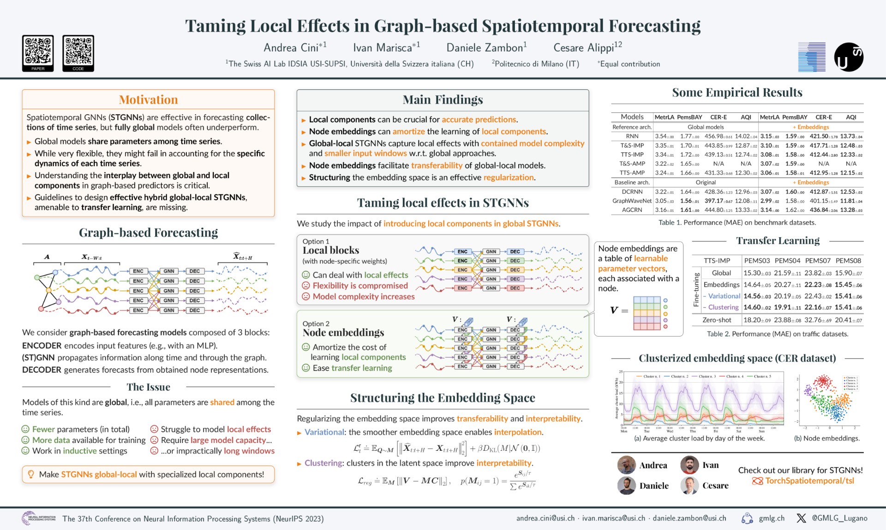

# Taming Local Effects in Graph-based Spatiotemporal Forecasting (NeurIPS 2023 - [pdf](https://arxiv.org/pdf/2302.04071.pdf))

[](https://neurips.cc/virtual/2023/poster/70034)
[](https://arxiv.org/pdf/2302.04071.pdf)
[](https://arxiv.org/abs/2302.04071)

This folder contains the code for the reproducibility of the experiments presented in the paper "Taming Local Effects in Graph-based Spatiotemporal Forecasting" (NeurIPS 2023). The paper studies the interplay between globality and locality in graph-based spatiotemporal forecasting, proposing a framework to rationalize the practice of including trainable node embeddings in such architectures.

**Authors**: [Andrea Cini](https://andreacini.github.io/), [Ivan Marisca](https://marshka.github.io/), [Daniele Zambon](https://dzambon.github.io/), [Cesare Alippi](https://alippi.faculty.polimi.it/)

<div align=center>
	
</div>

---

## Directory structure

The directory is structured as follows:

```
.
├── config/
├── lib/
├── conda_env.yaml
├── default_config.yaml
└── experiments/
    └── run_static_graph.py

```

## Datasets

The datasets used in the experiments are provided by the `tsl` library. The CER-E dataset can be obtained for research purposes following the instructions at this [link](https://www.ucd.ie/issda/data/commissionforenergyregulationcer/).

## Configuration files

The `config` directory stores all the configuration files used to run the experiment. They are divided into subdirectories according to the experiment they refer to.

## Requirements

To solve all dependencies, we recommend using Anaconda and the provided environment configuration by running the command:

```bash
conda env create -f conda_env.yml
conda activate taming-env
```

## Experiments

The script used for the experiments in the paper is in the `experiments` folder.

* `run_static_graph.py` is used to train and evaluate models on the datasets considered in the study. As an example, to run the TTS-IMP baseline with embeddings on the METR-LA dataset:

	```
	python experiments/run_static_graph.py config=benchmarks model=ttg_iso embedding=uniform dataset=la 
	```


## AZ-analysis

- just use run_ckpt
```bash
#missing data on la
CUDA_VISIBLE_DEVICES=0 python -m experiments.run_ckpt config=az_la_missing model=rnn,fcrnn,agcrn embedding=none dataset=la --multirun
CUDA_VISIBLE_DEVICES=0 python -m experiments.run_ckpt config=az_la_missing model=dcrnn,gwnet embedding=none dataset=la --multirun

python -m experiments.run_ckpt config=az_la_missing model=dcrnn,gwnet embedding=none dataset=la --multirun
python graph_sign_test/experiments/tsl_read_ckpt.py logs/az_la_missing/az_la_missing.yaml
```


to complete
```bash
#gpvar
CUDA_VISIBLE_DEVICES=1 python -m experiments.run_ckpt config=az_gpvar model=rnn,ttg_iso embedding=none,uniform dataset=gpvar --multirun
CUDA_VISIBLE_DEVICES=1 python -m experiments.run_ckpt config=az_gpvar model=rnn,ttg_iso embedding=none,uniform dataset=lcgpvar --multirun
CUDA_VISIBLE_DEVICES=1 python -m experiments.run_ckpt config=az_gpvar model=rnn,ttg_iso embedding=none,uniform dataset=lgpvar --multirun

#v3
CUDA_VISIBLE_DEVICES=2 python -m experiments.run_ckpt config=az_gpvar model=rnn,ttg_iso embedding=none,uniform dataset=gpvar,lcgpvar,lgpvar --multirun
CUDA_VISIBLE_DEVICES=2 python -m experiments.run_ckpt config=az_gpvar model=local_rnn embedding=none dataset=gpvar,lcgpvar,lgpvar --multirun
```